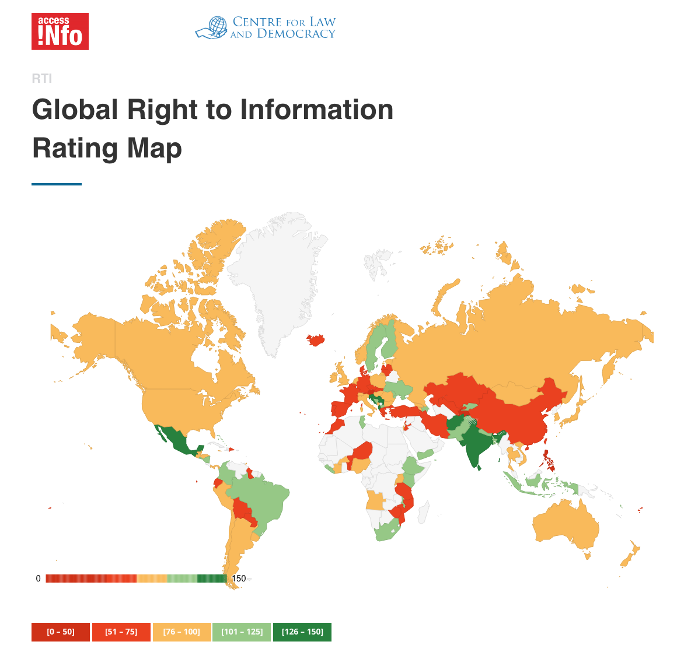
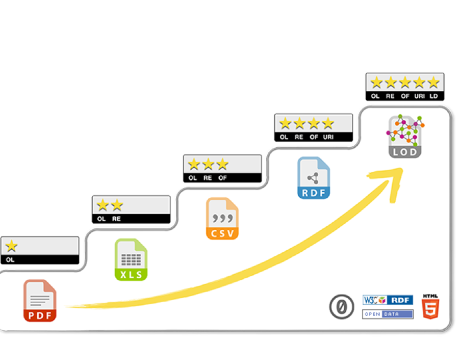
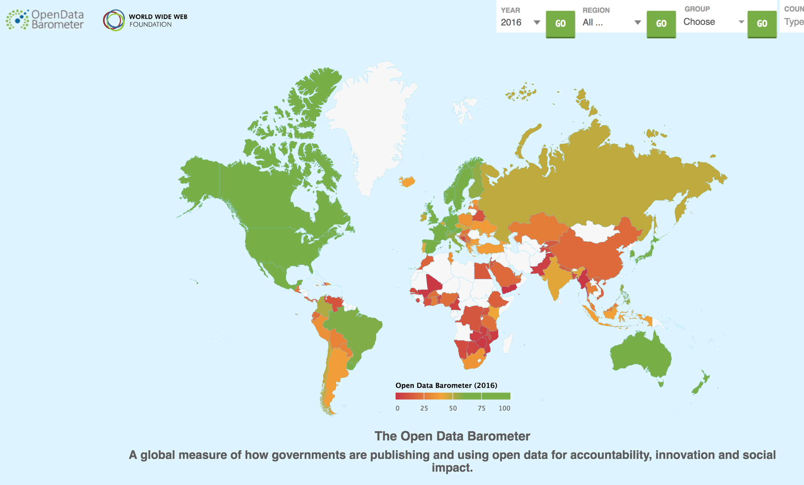

layout: true
  

`r paste0("
", params$event, " 

")` 

---

class: center, middle

Ces slides en ligne : `r paste0("http://datactivist.coop/", params$slug)`

Sources : `r paste0("https://github.com/datactivist/", params$slug)`

Les productions de Datactivist sont librement réutilisables selon les termes de la licence [Creative Commons 4.0 BY-SA](https://creativecommons.org/licenses/by-sa/4.0/legalcode.fr).

 
 

.reduite[]

---

### We .red[open data], we make them .red[useful]

.reduite.center[]

---
## Qui sommes nous ?

- Datactivist est un .red[**pure player de l’open data**] créé en 2016, par Samuel Goëta et Joël Gombin.

- Se positionnant sur .red[**toutes les étapes du travail d’ouverture des données**], Datactivist travaille tant avec les producteurs de données qu’avec les réutilisateurs et participe à l’appropriation des données par chacun.

- Nous appliquons nos propres .red[**valeurs**] : nous sommes une coopérative ; nos supports de formation et nos contenus sont librement réutilisables, publiés en licence Creative Commons.

- Une approche issue de la recherche : voir notamment **https://datactivist.coop/these**. 

- Nous animons la communauté [#TeamOpenData](https://teamopendata.org).

---
## Nos activités

- Conseil sur les .red[**stratégies d’ouverture de données**] : nous aidons les organisations dans la conception et la mise en œuvre de leur stratégie d’ouverture de données.

- .red[**Accompagnement dans la réutilisation de données ouvertes**] : nous aidons les organisations à utiliser les données au quotidien. 

- .red[**Sensibilisation et formation à la donnée**] : nous formons à la culture générale des données, nous enseignons les grands principes et bonnes pratiques de l'open data et nous introduisons à la data science. 

- .red[**Médiation de données**] : nous organisons des hackathons, des open data camps, des expéditions de données...

???

La médiation de données est aussi fondamentalement une animation de communauté(s). 

---
## Notre vision

### D'un open data de l'offre à un .red[open data de la demande]

Aujourd’hui, les administrations choisissent les données à ouvrir, elles décident du quand et du comment .red[**sans consulter les usagers**].

Les rares données ouvertes sont souvent décevantes : pas à jour, trop agrégées, mal documentées, mal formatées, parfois inutilisables. 

Il faut aujourd’hui passer à l’étape supérieure : .red[**un open data piloté par la demande**].

Mais c'est difficile : demande peu visible, pas de possibilité de soumettre la communication des données à l'expression d'une demande. Leviers : demandes d'ouverture, plateformes, animations (ex : hackathon), gouvernance partagée... 

---
## Rappel des objectifs de la formation 

> * Comprendre les grands principes de l'ouverture des données

> * Appréhender le cadre juridique spécifique aux données publiques

> * Maitriser les enjeux liés à la qualité des donnéess publiques pour faciliter la réutilisation

> * Disposer des informations essentielles pour initier une démarche d'open data dans son institution

**Vos attentes spécifiques :** 
* Problématiques liées à l'image
* Rôle de l'archiviste dans un projet d'open data

---
## Rappel du programme de la formation 

* Elements d'histoires d'ouverture des données

* Revue des grands principes de l'open data

* Le droit de la réutilisation des données publiques et les obligations issues de la loi pour une République numérique

* La conduite d'un projet d'open data et ses facteurs de succès

* Les bénéfices internes et externes

* Panorama des usages des données ouvertes

* L'enjeu de la qualité des données : exercice avec le data sprint de la FING

---
class: inverse, center, middle

# Elements du cadre juridique de l'open data

---
### Le guide CADA-CNIL : le document de référence

Je n'indique ici que quelques éléments généraux sur le cadre juridique, ce guide constitue votre source de référence. Joël Gombin, co-fondateur de Datactivist, a publié sa [fiche de lecture](https://teamopendata.org/t/guide-commun-cnil-et-cada-open-data-rgpd/1320) sur TeamOpenData.

.reduite.center[

]

---

## 1978 : La loi CADA, vers le "droit de savoir"
* Le fondement : la .red[Déclaration des Droits de l'Homme et du Citoyen de 1789] dans son article 15, "la Société a le droit de demander compte à tout Agent public de son administration." 

* Le droit d'accès des citoyens à l'information publique émerge en **1978 avec la loi dite CADA** du nom de la Commission d'Accès aux Documents Administrations Administratifs. 

* La France était le .red[3e pays au monde] après la Suède en 1766 et les Etats-Unis en 1966 avec le Freedom of Information Act (FOIA) en 1966  à accorder un "droit de savoir" avec pour but d'améliorer les relations entre le public et l'administration.

.footnote[Il faudrait maintenant désigner la loi comme le Code des relations entre le public et l'administration (CRPA) qui, dans son [livre 3](https://www.legifrance.gouv.fr/affichCode.do;jsessionid=BDF8EC0BD562E214CCD9A5ADD435D690.tplgfr42s_1?idSectionTA=LEGISCTA000031367685&cidTexte=LEGITEXT000031366350&dateTexte=20190429), codifie le droit d'accès et de réutilisation mais il est encore moins connu que la loi CADA…]

---
### La loi CADA : un point noir dans la transparence de la vie publique

Même si la France est le 3e pays à avoir adopté un droit d'accès, la loi CADA n'est pas un outil fort de la transparence de la vie publique. Ses principaux défauts : l'absence de sanctions et une procédure longue qui décourage les demandeurs et favorise le contournement par les administrations. 

---
### Un droit d'accès très faible au regard des standards internationaux

.pull-left[Paradoxe : la France a une législation parmi les plus ambitieuses au monde en matière d'open data mais le droit d'accès y est un des plus mauvais au monde… 

La France est classée .red[105e sur 123] du classement mondial des lois d'accès à l'information publique RTI Rating.

L'open data est comme la Tour de Pise : un très bel édifice posé sur des fondations instables.
]

.pull-right[

]

---
### Les conditions d'exercice du droit d'accès

.red[ Une définition très large des documents administratifs]
> Les documents administratifs peuvent revêtir de nombreuses formes (dossiers, rapports, études, comptes rendus, procès-verbaux, statistiques, directives, instructions, circulaires, codes sources, etc.) et adopter tout support (écrit, enregistrement sonore ou visuel, forme numérique ou informatique). 

Le droit d'accès s'appplique aux documents administratifs produits dans le cadre d'une .red[mission de service public] ie :
> Une mission d'intérêt général sous le contrôle de l'administration et qui est dotée à cette fin de prérogatives de puissance publique est chargée de l'exécution d'un service public." 

Il ne s’exerce que si l’administration a effectivement en sa possession le document demandé, que si le document est formellement **achevé**, qu'il existe et qu'il n'est pas **préparatoire à une décision administrative** en cours. 

---
### Les exclusions au droit d'accès

Le droit d'accès .red[**ne doit pas porter atteinte aux secrets protégés**] : 
- le fonctionnement de l'État :délibérations du Gouvernement, secret de la défense national, la conduite de la politique extérieure de la France, la sûreté de l'Etat…
- la protection de la vie privée
- le secret médical
- le secret des affaires (secret des procédés, des informations économiques et financières et
des stratégies commerciales ou industrielle
- les mentions portant une appréciation ou un jugement de valeur sur une personne physique ou
faisant apparaître un comportement d'une personne pouvant lui porter préjudice…

Le document ne peut être publié qu'après avoir fait l'objet d'un traitement permettant
d'.red[**occulter les mentions protégées**]. L’administration n’est pas tenue de publier un document lorsque “les travaux d’occultation dénatureraient ou videraient de sens le document” ou si “le document est indivisible ou l’occultation est trop complexe”.
---
### Le cas des données personnelles

La prohibition de la communication à des tiers ne porte pas sur les données personnelles en général, mais .red[**sur les données à caractère personnel relevant de la vie privée**] des personnes concernées (âge, coordonnées personnelles, situation patrimoniale et financière, sympathies politiques, les croyances religieuses…)

La mise en ligne de données à caractère personnel sans anonymisation n'est permise que dans trois cas :
1. une disposition législative contraire le prévoit (exemple : [Transparence Santé](https://www.data.gouv.fr/fr/datasets/transparence-sante-1/))
2. si les personnes intéressées ont donné leur accord (consentement au sens de l’article 4 du RGPD)
3. les documents relevant de [l’article D312-3-1 du CRPA](https://www.legifrance.gouv.fr/affichTexte.do;jsessionid=51E99AF738C12521572D6A7F6C8C03E8.tplgfr23s_1?cidTexte=JORFTEXT000037797147&dateTexte=&oldAction=rechJO&categorieLien=id&idJO=JORFCONT000037796937)

Hors de ces cas, il faut .red[**anonymiser les données**] : elles ne doivent plus se référer à une personne réelle (exit les noms, identifiants…) et ne doivent plus être spécifiques à un individu mais communes à un ensemble de personnes. L’indexation de ces données par un moteur de recherche externe est proscrite.

---
## Du droit d'accès au droit de réutilisation

---

## 2005: the Open Definition
### Define the rights of users of open knowledge
.reduite[]
---
## 2007: Sebastopol meeting
###Open all public data as soon as produced
.reduite[]
---
## 2008: "Raw data now"
###Get all the raw data

---
## 2010: the 5-star model
### Get machine-readable data
.reduite[]
---
# Technical principles without political depth
>"It may be true in some sense that a regime becomes more open whenever it provides additional open data, even for mun- dane and apolitical topics, but **it is easy to imagine that a closed regime might disclose large amounts of data conforming to these eight requirements without in any way advancing its actual accountability as a government**. 

> […] An electronic release of the propaganda statements made by North Korea’s political leadership, for example, might satisfy all eight of these requirements and might not tend to promote any additional transparency or accountability on the part of the notoriously closed and unaccountable regime."

>Yu & Robinson (2012) « The New Ambiguity of Open Government » 

---
# 2011: Open Government Declaration

---
#Open Government: how it works? 

---
# Since 2010: the era of rankings

---
#Since 2010: the era of rankings

---
#2013: the G8 Open Data Charter

---
#2015: the International Open Data Charter

---
class: inverse, center, middle

# Merci !

Contact : [samuel@datactivist.coop](mailto:samuel@datactivist.coop)